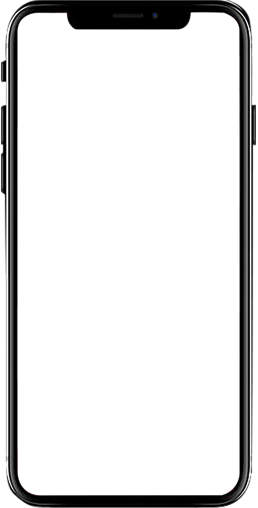

# jQuery Video Player Demo

基于jQuery实现的视频播放器演示项目，支持动态数据加载和交互控制。

## 功能特性
- 动态加载视频播放列表（AJAX请求）
- 键盘方向键控制视频切换（←/→）
- 滚轮控制音量调节
- 响应式布局适配
- 手机界面模拟展示

## 快速开始
1. 直接打开index.html即可运行
2. 点击按钮测试DOM操作
3. 使用键盘方向键切换视频
4. 滚动鼠标滚轮调节音量

## 技术栈
- jQuery v1.10.2
- HTML5 Video
- CSS3动画

## 项目结构
```
├── index.html    # 主界面
├── script.js     # 交互逻辑
├── style.css     # 样式布局
├── phone.png     # 设备框架图
└── LICENSE       # MIT许可证
```



## 许可证
本项目基于 [MIT License](LICENSE) 授权